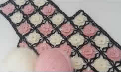
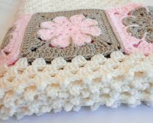
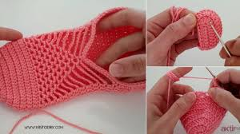
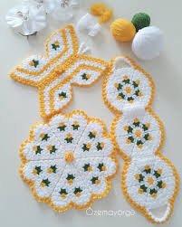
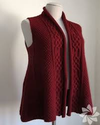

# web-sayfas-
Div içinde Html Css kullanılarak web sayfası<!DOCTYPE html PUBLIC "-//W3C//DTD XHTML 1.0 Transitional//EN" "http://www.w3.org/TR/xhtml1/DTD/xhtml1-transitional.dtd">
<html xmlns="http://www.w3.org/1999/xhtml">
<head>
<meta http-equiv="Content-Type" content="text/html; charset=utf-8" />
<title>örgü dünyası</title>
<link href="style.css" rel="stylesheet" type="text/css" />

	
		
</head>

<body>

  <ul>
    <li><a href="https://tr.wikipedia.org/wiki/%C3%96rme">ANA SAYFA</a></li>
	<li><a href="#">HAKKIMIZDA</a>
        <ul>
          <li><a href="#">Tarihçemiz</a></li>
        </ul>
    </li>
    <li onfocus="MM_openBrWindow('&quot;yem.jfif&quot;','içerik','width=300,height=300')"><a href="#">ÜRÜNLERİMİZ </a>
        <ul>
          <li><a href="yem.jfif">Tığ Oyalarımız </a></li>
          <li><a href="yelek.jfif">Tığ-Şiş Ürünlerimiz</a></li>
        </ul>
    </li>
    <li><a href="iletişim.html">İLETİŞİM</a></li>
  </ul>

  

    <ul>
      <li><a href="battaniye2.jfif" onclick="MM_openBrWindow('battaniye1.jfif','','width=200,height=300');MM_openBrWindow('battaniye1.jfif','içerik','location=yes,width=300,height=300')">Battaniye Modelleri</a></li>
      <li><a href="yelek1.jfif">Yelek Modelleri</a></li>
      <li><a href="lif1.jfif">Lif Modelleri</a></li>
      <li><a href="pat1.jfif">Patik Modelleri</a></li>
      <li><a href="yem.jfif">Yemeni modelleri</a></li>
    </ul>
  

  

    

   
    <h1></h1>
  

  

  

  

  

    <blockquote>
      
Örgü Dünyası örgü tariflerimizi örgüseverlerle paylaşmak

      <blockquote>
        
ve örgü sevenlerin görüp takip edebilecegi  bir platformdur.

        
<a href="#">İletişim İçin Buraya Tıklayınız</a>

    
  

</body>
</html>

